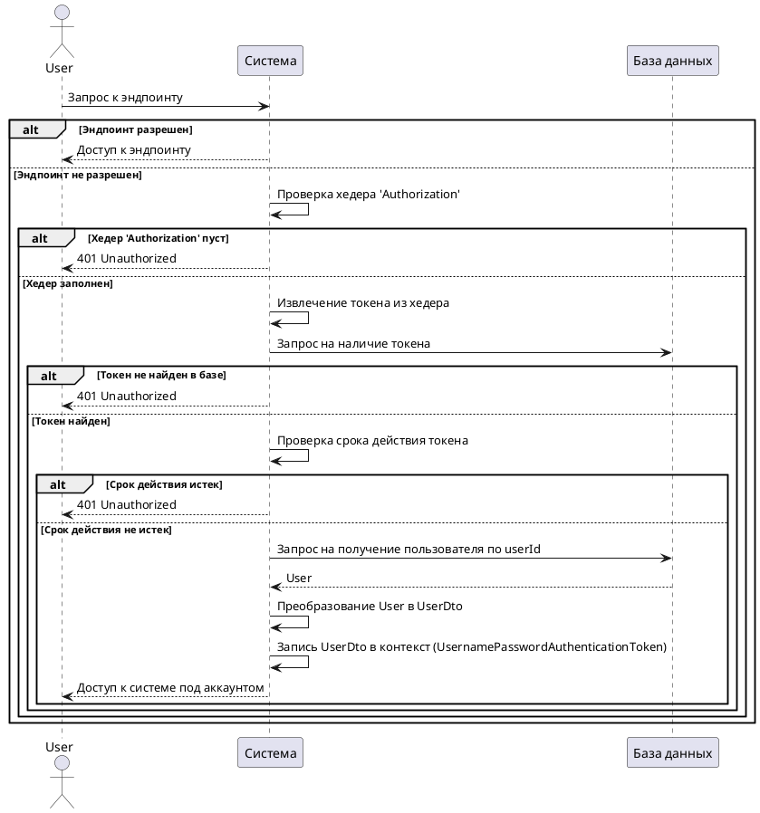
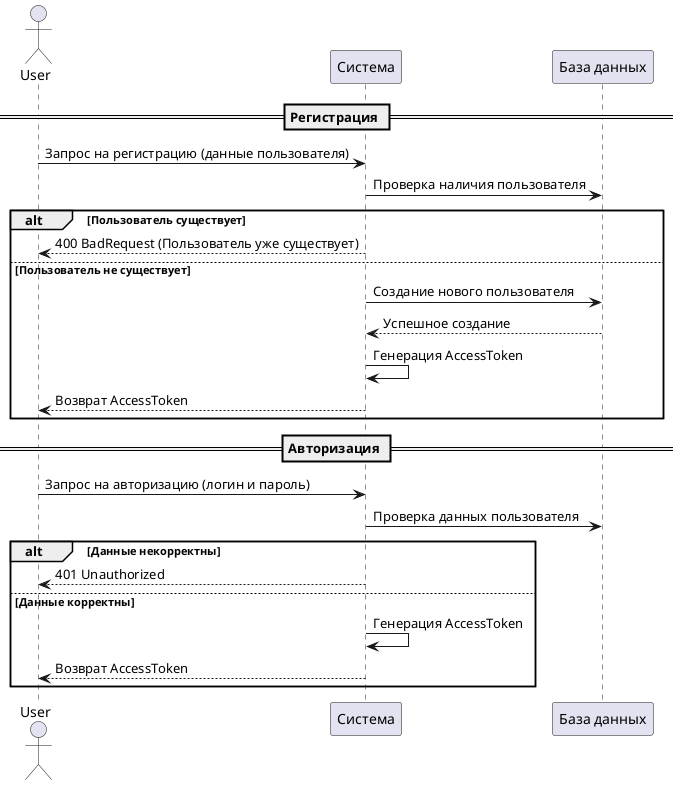

## Как попасть в Swagger

1. Запустите приложение
2. Перейдите по ссылке: http://localhost:8080/swagger-ui/index.html#

## Авторизация и аутентификация

Каждый токен в системе = сессия пользователя

### Общий процесс

Когда пользователь приходит в систему идет проверка на то, является ли эндпоинт разрешенным  
Если да, то пользователь получает к нему доступ
Если нет, то нет то:

1. Достаем хэдер 'Authorization' из запроса, если он пуст выдаем 401
2. Если заполнен, то достаем оттуда токен
3. Идет запрос к базе данных на проверку того, хранится ли там данный токен
4. Если хранится, то проверяем его время жизни, если оно истекло, то 401
5. Если не истекло, то достаем userId из токена и получаем пользователя из бд
6. Преобразуем сущность User в UserDto и зашиваем в контекст UsernamePasswordAuthenticationToken с нашим пользователем
7. Далее пользователь ходит в системе под своим аккаунтом

### Регистрация или авторизация

В случае регистрации мы создаем пользователя и тут же генерируем для него AccessToken, который мы возвращаем  
В случае авторизации, мы сразу проверяем данные пользователя, если все верно, то после этого генерируем и возвращаем
токен

